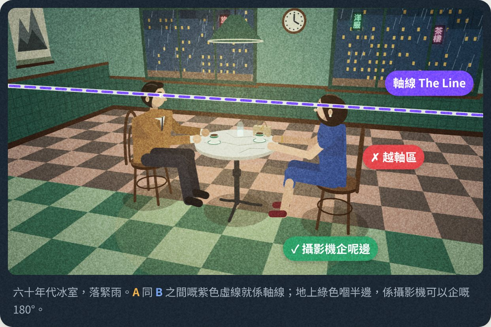

# 180度法則互動課 v2

教電影學生「180度法則」嘅互動網頁：軸線喺邊、三部機點擺（Master＋兩個近鏡）、視線點樣連到戲、剪接時間線，同埋越軸之後連戲點樣出錯。



## 點睇

- **網上**：開咗 GitHub Pages 之後，網址係 `https://<你嘅帳號>.github.io/<repo 名>/`
- **離線**：直接用瀏覽器開 `index.html`，唔使安裝任何嘢

## 內容

1. **條線喺邊**：拖動角色同攝影機，軸線同 180° 範圍即時跟住變
2. **三部機點擺**：平面圖沙盤，三個監視器即時顯示每部機嘅畫面
3. **視線匹配**：CU A 剪去 CU B，對望定冇對望
4. **越軸會點錯**：四種常見錯誤，✓ 同 ✗ 並排對照
5. **剪接**：multicam 時間線，播緊都可以切鏡，每個剪接點自動檢查
6. **點樣合法過線**：移動鏡頭、中性鏡頭、角色走位、插入鏡頭

## 修改內容

所有畫面都係用 Canvas 2D 按攝影機位置即時畫出嚟，冇用外部程式庫（字型用 Google Fonts）。

改 `src/` 入面嘅檔案之後，喺 repo 最上層行：

```
python3 src/build.py
```

就會重新砌出 `index.html`。

| 檔案 | 用途 |
| --- | --- |
| `src/render.js` | 場景、角色、鏡頭計算 |
| `src/app.js` | 平面圖、各章節互動、剪接時間線 |
| `src/page.html` | 文字內容 |
| `src/page.css` | 版面同顏色 |

## 備註

角色、場景同對白全部原創。《閃靈》（The Shining）同小津安二郎只係作為「刻意越軸」嘅例子提及。
